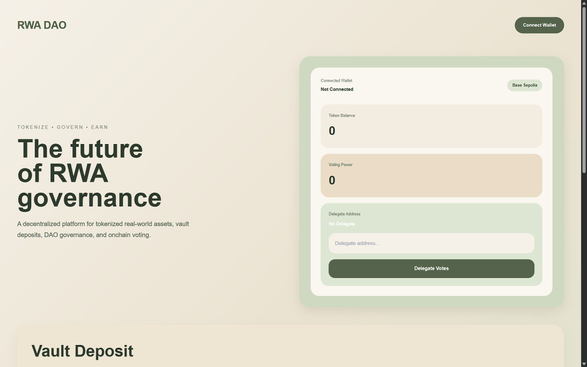
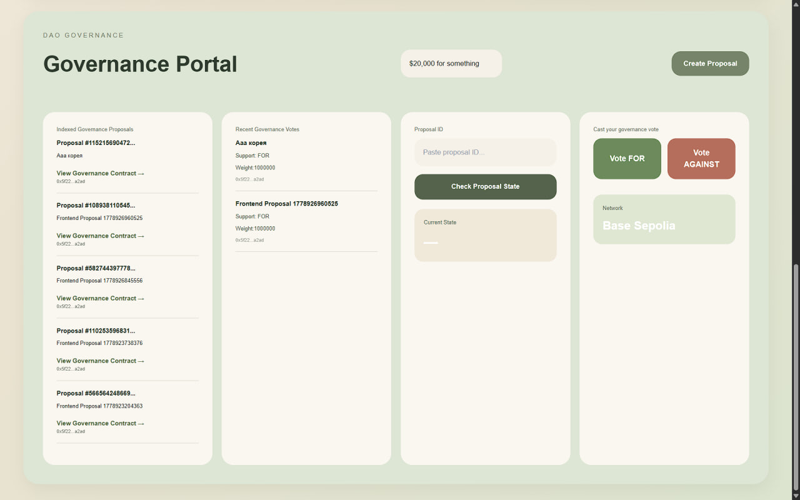
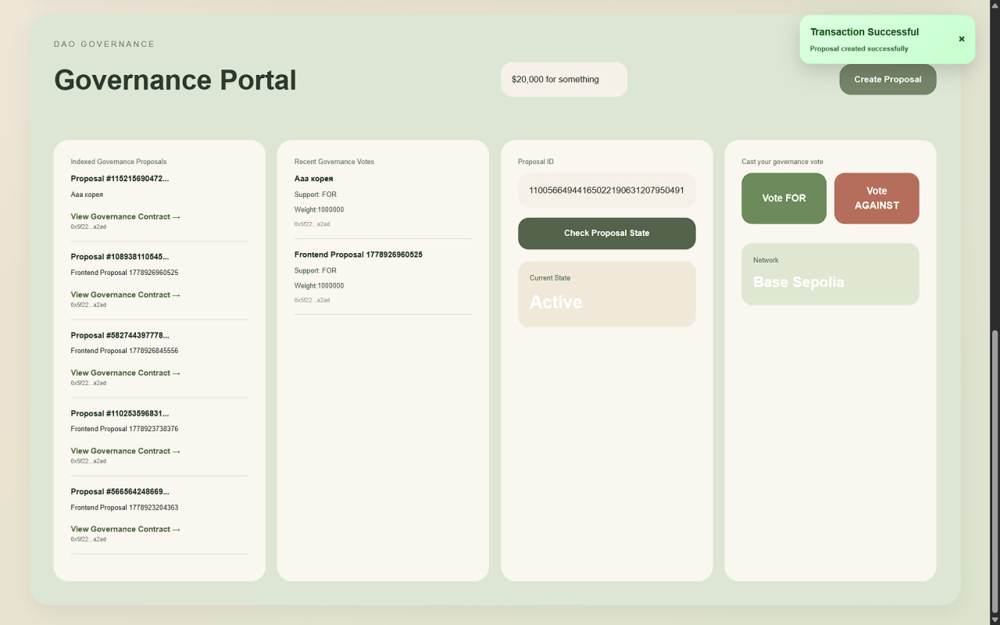
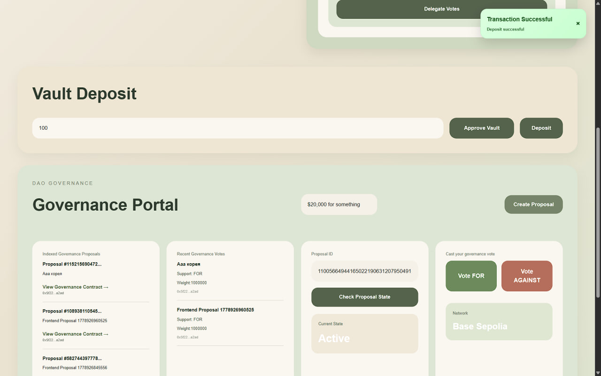

````md
# RWA DAO Tokenization Platform

A full-stack decentralized protocol for real-world asset (RWA) tokenization, governance, and yield vault management built on Base Sepolia.

This project was developed as the final capstone project for Blockchain Technologies 2.

---

# Overview

The platform combines:

- ERC20 governance token
- DAO governance system
- ERC4626 tokenized vault
- Onchain delegation and voting
- The Graph indexing
- L2 deployment on Base Sepolia
- React frontend with Wagmi integration

Users can:

- Connect their wallet
- Delegate governance voting power
- Create DAO proposals
- Vote on governance proposals
- Deposit tokens into the ERC4626 vault
- View indexed governance activity from The Graph

---

# Architecture

## Smart Contracts

### RWAToken

ERC20 governance token with:

- ERC20Votes
- ERC20Permit
- Role-based minting
- Delegated governance voting

### Governance

OpenZeppelin Governor implementation featuring:

- Proposal creation
- Voting system
- Timelock governance
- Proposal state management

### TimelockController

Secures governance execution through delayed proposal execution.

### RWAVault

ERC4626 tokenized vault for RWA deposits and yield accounting.

---

# Tech Stack

## Smart Contracts

- Solidity
- OpenZeppelin
- Foundry

## Frontend

- React
- Wagmi
- Viem

## Indexing

- The Graph

## Deployment

- Base Sepolia
- BaseScan

---

# Frontend Features

- MetaMask wallet connection
- Wrong network detection
- Token balance display
- Governance voting power display
- Delegate address management
- Proposal creation UI
- Proposal state tracking
- Governance vote interface
- ERC4626 approve/deposit flow
- Indexed proposal activity
- Indexed vote activity
- Transaction notifications and error handling

---

# Governance Flow

1. User connects wallet
2. User delegates voting power
3. User creates proposal
4. DAO proposal becomes active
5. Users vote FOR or AGAINST
6. Proposal state is tracked onchain
7. Governance events are indexed by The Graph

---

# ERC4626 Vault Flow

1. User approves vault allowance
2. User deposits RWA tokens
3. Vault receives assets
4. Deposit activity becomes visible onchain

---

# The Graph Integration

The protocol uses a custom subgraph for indexing governance and vault events.

## Indexed Entities

- Proposal
- Vote
- Deposit
- DelegateChange

---

# GraphQL Queries

## Get Proposals

```graphql
{
  proposals(first: 5) {
    proposalId
    description
    proposer
  }
}
````

## Get Votes

```graphql
{
  votes(first: 5) {
    voter
    proposalId
    support
    weight
  }
}
```

## Get Deposits

```graphql
{
  deposits(first: 5) {
    owner
    assets
    shares
  }
}
```

## Get Delegate Changes

```graphql
{
  delegateChanges(first: 5) {
    delegator
    fromDelegate
    toDelegate
  }
}
```

## Get Proposal Activity

```graphql
{
  proposals(first: 5) {
    proposalId
    description
  }

  votes(first: 5) {
    voter
    support
  }
}
```

---

# Verified Contracts

## RWAToken

[https://sepolia.basescan.org/address/0x7B3B6F99ada780d409bD713d32896f81006350F9](https://sepolia.basescan.org/address/0x7B3B6F99ada780d409bD713d32896f81006350F9)

## Governance

[https://sepolia.basescan.org/address/0xdebd86C48B54a421B2C8ba90eF4117B7D5Aa78e5](https://sepolia.basescan.org/address/0xdebd86C48B54a421B2C8ba90eF4117B7D5Aa78e5)

## RWAVault

[https://sepolia.basescan.org/address/0x94de1B8d49a036ddD287bC5eEA5879C9924D6e45](https://sepolia.basescan.org/address/0x94de1B8d49a036ddD287bC5eEA5879C9924D6e45)

---

# Subgraph

## Subgraph Studio

[https://thegraph.com/studio/subgraph/rwa-dao-subgraph](https://thegraph.com/studio/subgraph/rwa-dao-subgraph)

## Query Endpoint

[https://api.studio.thegraph.com/query/1753362/rwa-dao-subgraph/v0.0.2](https://api.studio.thegraph.com/query/1753362/rwa-dao-subgraph/v0.0.2)

---

# Layer 2 Deployment

The protocol is deployed on Base Sepolia to reduce gas costs and improve governance usability.

## Example L2 Advantages

| Operation         | Ethereum Mainnet | Base Sepolia |
| ----------------- | ---------------- | ------------ |
| Token Transfer    | High Cost        | Low Cost     |
| Proposal Creation | Expensive        | Cheap        |
| Governance Voting | Expensive        | Cheap        |
| Vault Deposit     | Medium Cost      | Cheap        |
| Delegation        | Medium Cost      | Cheap        |

---

# Running Locally

## Install Dependencies

```bash
forge install
npm install
```

## Build Contracts

```bash
forge build
```

## Run Tests

```bash
forge test
```

## Start Frontend

```bash
cd frontend
npm install
npm run dev
```

---

# Deployment

## Deploy Contracts

```bash
forge script script/DeployGovernance.s.sol \
--rpc-url https://sepolia.base.org \
--broadcast
```

## Deploy Subgraph

```bash
graph deploy rwa-dao-subgraph
```

---

# Screenshots

## Governance Dashboard



## Proposal Creation



## Governance Voting



## Vault Deposit



---

# Security

The protocol uses:

* OpenZeppelin Governor
* TimelockController
* AccessControl
* ERC20Votes
* ERC4626
* Role-based authorization
* Reentrancy-safe architecture
* Safe transaction handling

---

# Team Contributions

## Smart Contracts

* DAO governance
* ERC20 token
* Vault architecture
* Timelock system

## Frontend + Subgraph + L2

* React governance dashboard
* Wagmi integration
* The Graph indexing
* GraphQL integration
* Base Sepolia deployment
* Contract verification
* Governance activity feed

---

# License

MIT

```
```
